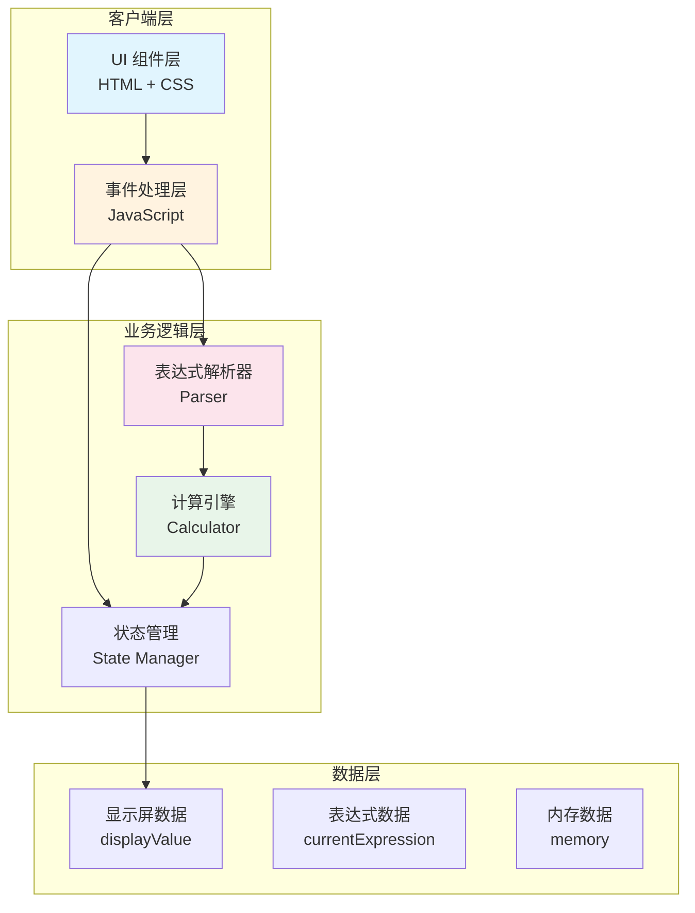

# 计算器架构设计文档

## 1. 系统架构图



## 2. 技术选型

| 层级 | 技术 | 选型理由 |
|------|------|----------|
| 结构层 | HTML5 | 语义化标签，无障碍支持 |
| 表现层 | CSS3 + Flexbox/Grid | 响应式布局，变量式主题 |
| 逻辑层 | Vanilla JavaScript (ES6+) | 轻量，无需构建工具 |
| 数学解析 | 自研表达式解析器 | 支持运算符优先级和括号 |
| 部署 | 静态文件托管 | 可部署至任意静态服务器 |

## 3. 组件设计

```
web-calculator/
├── index.html          # 主页面结构
├── style.css           # 样式表
├── script.js           # 主逻辑
└── SPEC.md             # 设计规范
```

### 3.1 HTML 结构

```html
<div class="calculator">
  <div class="display">          <!-- 显示屏 -->
    <div class="expression"></div>  <!-- 表达式 -->
    <div class="result">0</div>     <!-- 结果 -->
  </div>
  <div class="buttons">           <!-- 按钮区 -->
    <!-- 按钮通过 data-* 属性标识类型 -->
  </div>
</div>
```

### 3.2 按钮分类

| 类型 | 属性 | 功能 |
|------|------|------|
| 数字 | `data-number` | 输入数字 0-9 |
| 运算符 | `data-action="operator"` | + - × ÷ |
| 等于 | `data-action="equals"` | 执行计算 |
| 清除 | `data-action="clear"` | 清除当前 |
| 全清 | `data-action="clear-all"` | 清除全部 |
| 删除 | `data-action="backspace"` | 删除最后一位 |
| 小数点 | `data-number="."` | 输入小数点 |

### 3.3 核心模块

```javascript
// 状态管理器
const state = {
  currentValue: '0',      // 当前输入值
  expression: '',          // 表达式字符串
  hasResult: false,       // 是否刚得出结果
  memory: null            // M+ M- 内存
};

// 计算器核心
class Calculator {
  parse(expression)      // 解析表达式为 token 数组
  evaluate(tokens)        // 计算表达式结果
  handleOperator(op)      // 处理运算符
  handleNumber(num)      // 处理数字输入
}
```

## 4. API 设计

本项目为纯前端应用，无后端 API。交互通过事件驱动：

### 4.1 内部事件流

```
用户点击/键盘输入
       ↓
  Event Handler
       ↓
  State Update
       ↓
  UI Re-render
```

### 4.2 公开方法

| 方法 | 参数 | 返回值 | 说明 |
|------|------|--------|------|
| `input(number)` | string | void | 输入数字 |
| `inputOperator(op)` | string | void | 输入运算符 |
| `calculate()` | none | string | 执行计算 |
| `clear()` | none | void | 清除当前 |
| `clearAll()` | none | void | 清除全部 |
| `backspace()` | none | void | 删除最后一位 |
| `percentage()` | none | void | 百分比转换 |

## 5. 数据模型

### 5.1 状态对象

```typescript
interface CalculatorState {
  currentValue: string;      // 当前输入值，最多 15 位
  previousValue: string;     // 上一个输入值
  operator: string | null;   // 当前运算符
  waitingForOperand: boolean; // 等待下一个操作数
  expression: string[];      // 表达式数组 ['10', '+', '5']
  hasError: boolean;         // 是否显示错误
}
```

### 5.2 Token 类型

```typescript
type Token = 
  | { type: 'number', value: string }
  | { type: 'operator', value: '+' | '-' | '*' | '/' }
  | { type: 'paren', value: '(' | ')' }
  | { type: 'percent' };
```

### 5.3 验证规则

| 字段 | 规则 |
|------|------|
| currentValue | 最多 15 位有效数字 |
| 运算符后不能直接跟运算符 | 连续运算符取后者 |
| 除法除数不能为 0 | 显示 "Error" |
| 表达式最大长度 | 50 字符 |

## 6. 响应式断点

```css
/* 移动端优先 */
.calculator {
  width: 100%;
  max-width: 320px;
  padding: 12px;
}

/* 平板及以上 */
@media (min-width: 480px) {
  .calculator {
    max-width: 400px;
    padding: 20px;
    border-radius: 16px;
  }
}

/* 桌面端 */
@media (min-width: 768px) {
  .calculator {
    margin: 60px auto;
    box-shadow: 0 10px 40px rgba(0,0,0,0.1);
  }
}
```

## 7. 实现里程碑

| 阶段 | 内容 | 交付物 |
|------|------|--------|
| M1 | 基础版本 | HTML 结构 + 基本样式 + 四则运算 |
| M2 | 完善功能 | 括号支持 + 连续运算 + C/AC/DEL |
| M3 | 高级功能 | 小数 + 百分比 + 键盘支持 |
| M4 | 优化测试 | 响应式适配 + 无障碍 + Edge Case |

## 8. 浏览器兼容

- Chrome 80+
- Firefox 75+
- Safari 13+
- Edge 80+
