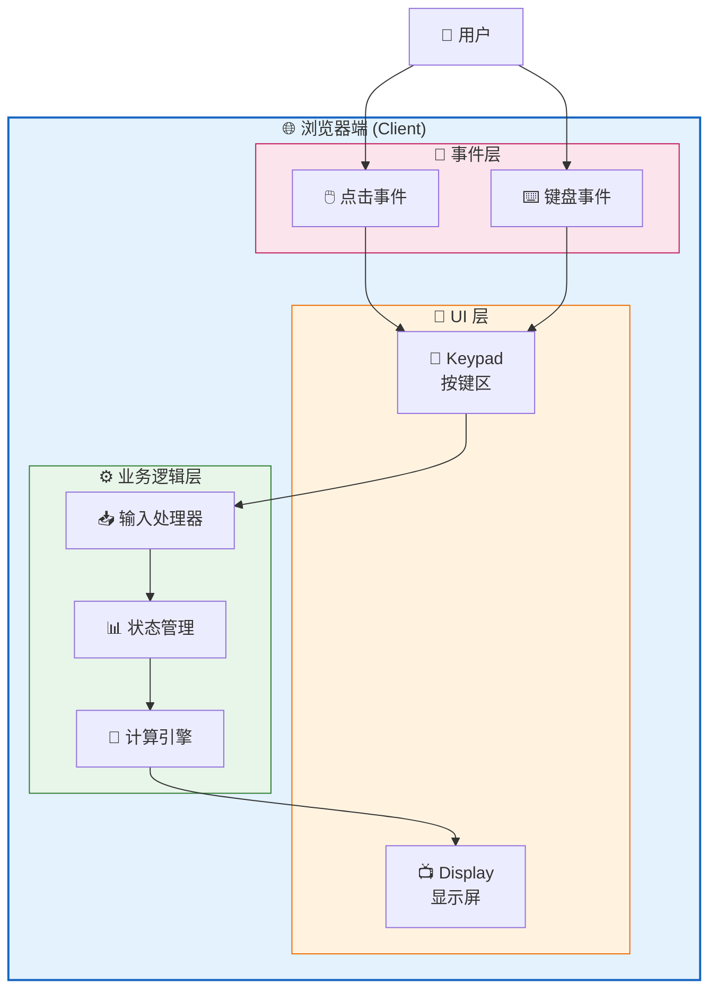
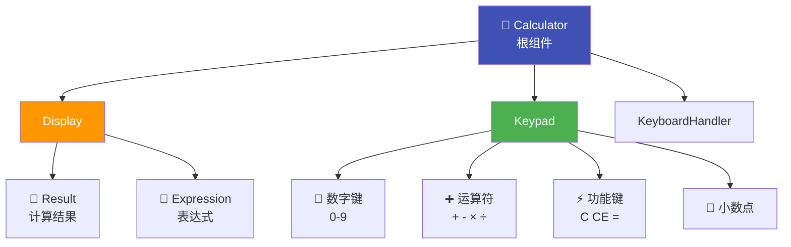
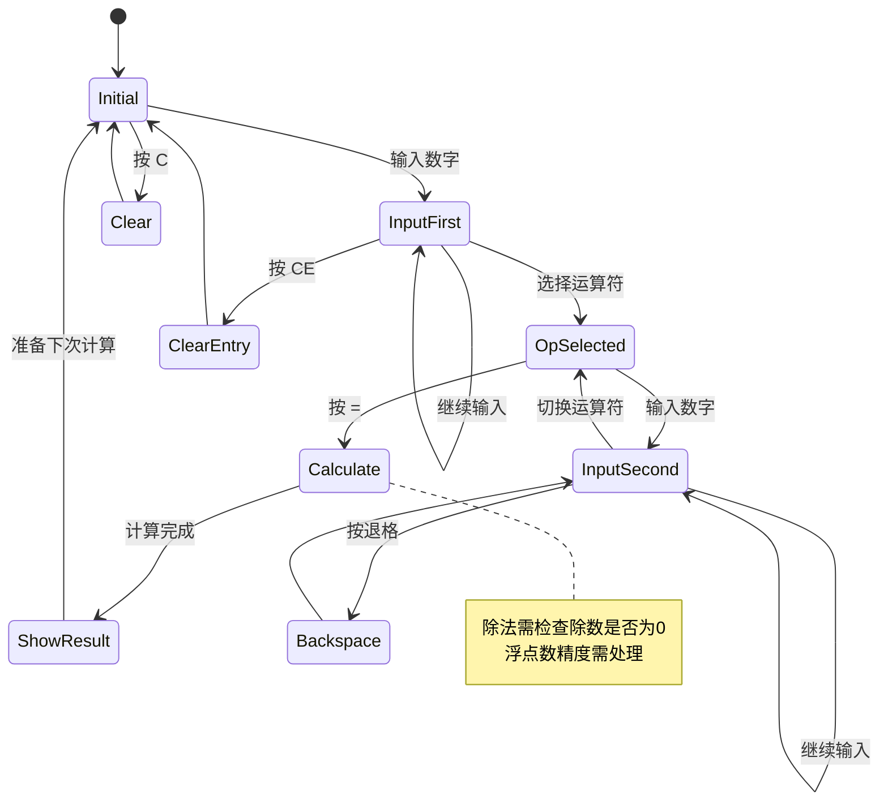
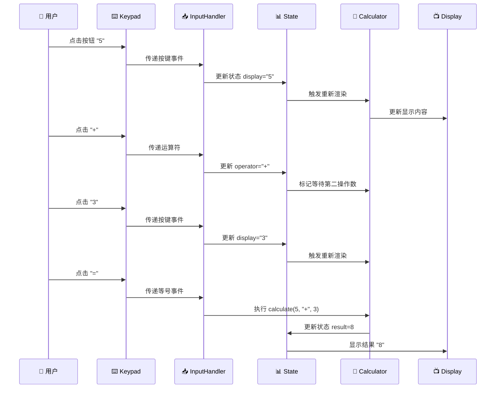
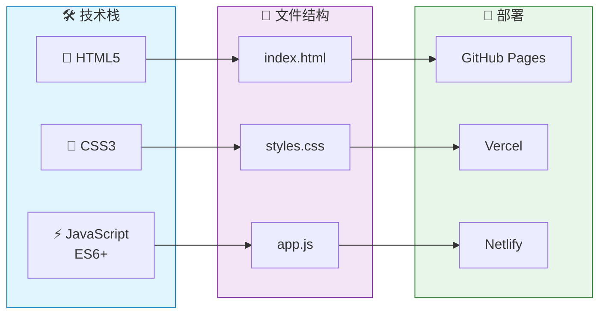
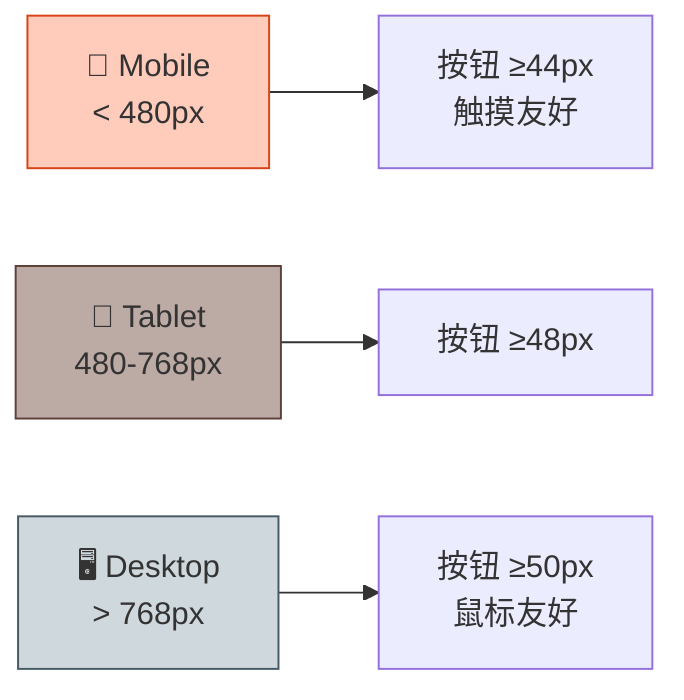

# 网页计算器 - 架构设计

## 1. 系统架构总览



## 2. 组件层次结构



## 3. 状态机流程



## 4. 数据流



## 5. 技术架构



## 6. 核心模块

### 6.1 Calculator 核心类

```javascript
class Calculator {
  // 状态
  state = {
    display: '0',
    firstOperand: null,
    operator: null,
    waitingForSecond: false
  };
  
  // 方法
  inputNumber(num) { ... }
  inputOperator(op) { ... }
  inputDecimal() { ... }
  calculate() { ... }
  clear() { ... }
  clearEntry() { ... }
  backspace() { ... }
}
```

### 6.2 计算精度处理

```javascript
// 浮点精度问题解决方案
function preciseCalculate(a, op, b) {
  const precision = 10; // 小数位精度
  let result;
  
  switch(op) {
    case '+': result = a + b; break;
    case '-': result = a - b; break;
    case '*': result = a * b; break;
    case '/': 
      if (b === 0) return 'Error';
      result = a / b;
      break;
  }
  
  // 四舍五入处理精度
  return Math.round(result * Math.pow(10, precision)) / Math.pow(10, precision);
}
```

## 7. 键盘映射

| 按键 | 功能 | 映射 |
|------|------|------|
| `0-9` | 数字输入 | `NumberButtons` |
| `+` | 加法 | `OperatorButton` |
| `-` | 减法 | `OperatorButton` |
| `*` | 乘法 | `OperatorButton` |
| `/` | 除法 | `OperatorButton` |
| `Enter` 或 `=` | 计算结果 | `EqualsButton` |
| `Escape` | 清除全部 (C) | `ClearButton` |
| `Backspace` | 退格 | `BackspaceButton` |
| `.` | 小数点 | `DecimalButton` |

## 8. 响应式断点



---

## 架构总结

| 维度 | 方案 |
|------|------|
| **架构类型** | 纯前端、单页面应用 |
| **技术栈** | 原生 HTML + CSS + JavaScript |
| **复杂度** | 低 |
| **依赖** | 零依赖 |
| **部署** | 静态文件托管 |
| **预估工时** | 1-2 天 |

**关键决策**: 由于 PRD 明确指出无需后端、无需 API，本项目采用最简单的原生 JS 实现，零依赖，可直接浏览器运行。
